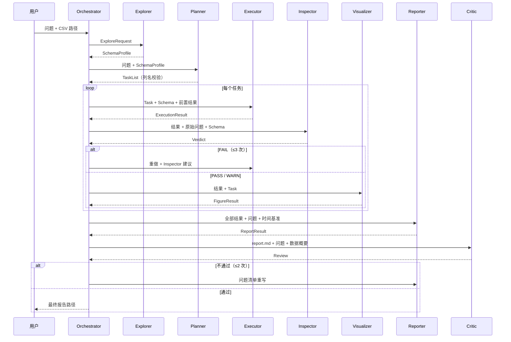

# Agent 交互设计（v1.1）

**项目**：基于多智能体协作的自动化数据分析引擎
**配套文档**：[需求分析.md](需求分析.md) / [输出格式设计.md](输出格式设计.md) / [工作规划.md](工作规划.md)

## 1. 交互模型：编排器中心化的消息路由

核心原则：**Agent 之间不直接互相调用**。所有消息都由 Orchestrator（编排器）路由，Agent 是"无状态工人"，只做三件事：读取输入消息 → 按角色处理（可能调用 LLM、执行代码）→ 返回结构化输出消息。

这样设计的好处：

- **全程可观测**：每条消息写入 transcript.jsonl，可回放、可调试；
- **职责解耦**：增删 Agent 不影响其他 Agent；
- **便于演进**：未来可替换为 LangGraph / CrewAI 等框架，消息协议保持不变。

## 2. 共享上下文 RunContext 与数据传递

- **小数据**（schema、任务、审核结论）走消息体；
- **大数据**（结果集、图表、报告）走文件，消息中只带文件路径引用。

RunContext 关键字段：

| 字段 | 说明 |
| :--- | :--- |
| run_id | 一次运行的唯一 ID |
| question | 用户原始问题 |
| data_path | CSV 路径 |
| schema_profile | Explorer 产出 |
| task_list | Planner 产出 |
| results | {task_id: ExecutionResult} |
| figures | {task_id: FigureResult} |
| report | ReportResult |
| time_base | 时间基准（默认数据最大日期） |
| config | 模型 / 超时 / 预算配置 |
| outputs_dir | outputs/run_<id>/ |
| transcript | 全部消息记录 |

outputs/run_<id>/ 目录结构：

```text
outputs/run_20260805_123456/
├── transcript.jsonl
├── schema_profile.json
├── plan.json
├── step_1_result.json        # Executor 中间结果
├── chart_task_1.png          # 图表
├── report.md
└── run_config.json           # 配置快照
```

## 3. 全流程交互序列



## 4. 消息种类清单

| 阶段 | 发送 → 接收 | kind | 内容 | 产物 / 副作用 |
| :--- | :--- | :--- | :--- | :--- |
| 探查 | O → Explorer | explore_request | data_path | schema_profile.json |
| | Explorer → O | schema_profile | SchemaProfile JSON | - |
| 规划 | O → Planner | plan_request | question + schema | - |
| | Planner → O | task_list | TaskList JSON | plan.json |
| 执行 | O → Executor | execute_task | task + schema + 前置文件引用 | step_*.json |
| | Executor → O | execution_result | success / failed + error_class | 中间文件 |
| 审核 | O → Inspector | inspect_result | 结果 + task + question + schema | - |
| | Inspector → O | verdict | PASS / WARN / FAIL + checks + suggestion | - |
| 可视化 | O → Visualizer | visualize | 结果 + task | chart_*.png |
| | Visualizer → O | figure_result | 图表路径 + 说明 | - |
| 报告 | O → Reporter | compose_report | 全部结果 + 图表 + question + time_base | report.md |
| | Reporter → O | report_result | 报告路径 + degraded 标记 | - |
| 评审 | O → Critic | review_report | report.md + question + 数据概要 | - |
| | Critic → O | review | PASS / FAIL + issues | - |
| 重写 | O → Reporter | rewrite_report | 报告 + issues | 覆盖 report.md |

## 5. 两个反馈闭环

### 5.1 数据审核闭环（Inspector ↔ Executor）

- **代码层**：Executor 内部，代码执行失败 → 错误信息回传 LLM 自愈，最多 3 次；
- **结果层**：Inspector 判 FAIL → 携带 suggestion 返回 Executor 重做，最多 3 次；
- 任一层耗尽 → 该任务判定 failed，进入降级路径。

### 5.2 报告评审闭环（Critic ↔ Reporter）

- Critic 不通过 → 携带 issues 返回 Reporter 重写，最多 2 次；
- 重写后再评审；仍不通过则输出当前版本并标注"未经评审通过"。

### 5.3 预算控制

- 单轮运行 LLM 调用总次数上限默认 30 次（config 可调），达到上限立即终止并走降级路径。

## 6. 失败传播与降级路径

错误分类枚举：`MISSING_COLUMN` / `EMPTY_RESULT` / `CODE_ERROR` / `TIMEOUT` / `LLM_ERROR` / `UNKNOWN`。

- 单任务失败且重试耗尽 → Orchestrator 将该任务标记 failed；若其他任务不依赖它，继续执行；
- 关键任务失败或总预算耗尽 → 本次运行标记 degraded；
- degraded 时：跳过 Visualizer（无图）、跳过 Critic，直接由 Reporter 生成降级报告（失败原因 + 建议）；
- 降级报告同样写入 outputs/run_<id>/，transcript 完整记录失败链路。

## 7. 实例走查

### 7.1 TC-02 正常流程（简化消息）

用户 → O：

```json
{"question": "最近7天每日销售额的走势如何？", "data_path": "demo/data/retail_sales.csv"}
```

O → Explorer：`{"data_path": "demo/data/retail_sales.csv"}`

Explorer → O：SchemaProfile（5 列，suggested_date_column=订单日期，max=2024-07-31）

O → Planner：`{"question": "...", "schema_profile": {...}}`

Planner → O：TaskList（task1：按日聚合销售额，required_columns=[订单日期, 销售额]，chart_type=line）

O → Executor：`{"task": {...}, "schema_profile": {...}}`

Executor → O：ExecutionResult（success，7 行日销售额，intermediate_file=step_1_result.json）

O → Inspector：`{"result": {...}, "task": {...}, "question": "...", "schema_profile": {...}}`

Inspector → O：Verdict（PASS，7 行非空、日期范围合理）

O → Visualizer：`{"result": {...}, "task": {...}}`

Visualizer → O：FigureResult（chart_task_1.png，note 指出最高 / 最低点）

O → Reporter：`{"question": "...", "results": {...}, "figures": {...}, "time_base": {"date": "2024-07-31"}}`

Reporter → O：ReportResult（report.md，sections 完整）

O → Critic：`{"report_path": "...", "question": "...", "data_summary": {...}}`

Critic → O：Review（PASS）

O → 用户：`{"status": "success", "report": "outputs/run_xxx/report.md"}`

### 7.2 TC-03 降级流程（简化消息）

O → Executor：`{"task": {"required_columns": ["利润"], ...}}`

Executor 内部代码自愈 3 次 → 均报 KeyError: '利润'

Executor → O：ExecutionResult（failed，error_class=MISSING_COLUMN，error="列 '利润' 不存在，可用列：[...]"）

O → Reporter：`{"degraded": true, "failure_info": {"error_class": "MISSING_COLUMN", "suggestion": "请检查列名或数据源"}}`

Reporter → O：ReportResult（degraded=true，报告含"未找到利润字段，请检查列名或数据源"）

O → 用户：`{"status": "degraded", "report": "outputs/run_xxx/report.md"}`

## 8. 实现要点

- `BaseAgent.run(context, message) -> AgentMessage`：内部 = LLM 调用 + pydantic 输出校验 + 失败重试；
- Orchestrator 按状态机推进：EXPLORE → PLAN → EXECUTE → VERIFY → VISUALIZE → REPORT → REVIEW → DONE / FAILED；
- 每条消息经 transcript 记录（含耗时、调用次数）；
- 消息协议以[输出格式设计.md](输出格式设计.md)为准，实现时落地为 pydantic 模型。

## 9. 执行模型：同步串行 + 可扩展并行

### 9.1 v1.1 默认：同步串行

工作流按状态机**逐步推进**，每个 Agent 调用阻塞等待返回，任意时刻只有一个 Agent 在"说话"：

- 原因：依赖关系严格（schema → plan → execute → inspect → visualize → report → review），串行最简单且正确；transcript 天然有序，便于回放与评审；重试轮次与 LLM 调用预算精确可数；单次运行分钟级完成，串行开销可接受。
- 内部细节：Executor 的代码在**子进程**执行，主进程同步等待其结束（超时由 wait 控制）；LLM 客户端为同步 HTTP 请求。

### 9.2 两个可并行的层面（路线图）

| 层面 | 并行方式 | 前提 | 收益 |
| :--- | :--- | :--- | :--- |
| 任务级 | Planner 拆出的**相互独立任务**由多个 Executor / Visualizer 并发处理（线程池或 asyncio） | 任务之间无数据依赖，数据通过中间文件传递 | 缩短单次运行耗时 |
| 运行级 | 不同 run_id 的多次运行互不干扰，可多进程 / 多线程同时跑 | 各自独立的 outputs/run_<id>/ 目录与配置 | 支持多用户 / 批量并发 |

### 9.3 切换为异步时的影响

- Orchestrator 从"顺序 for 循环"改为"按依赖图（DAG）调度"，只有无依赖的任务并发；
- Agent 消息协议、文件传递、transcript 格式**不变**，因此从同步演进到异步不需要重写 Agent；
- 代价：日志排序、预算统计、重试控制需要增加并发上下文，复杂度上升。因此 v1.1 先同步实现，验证正确性后再按需并行。
