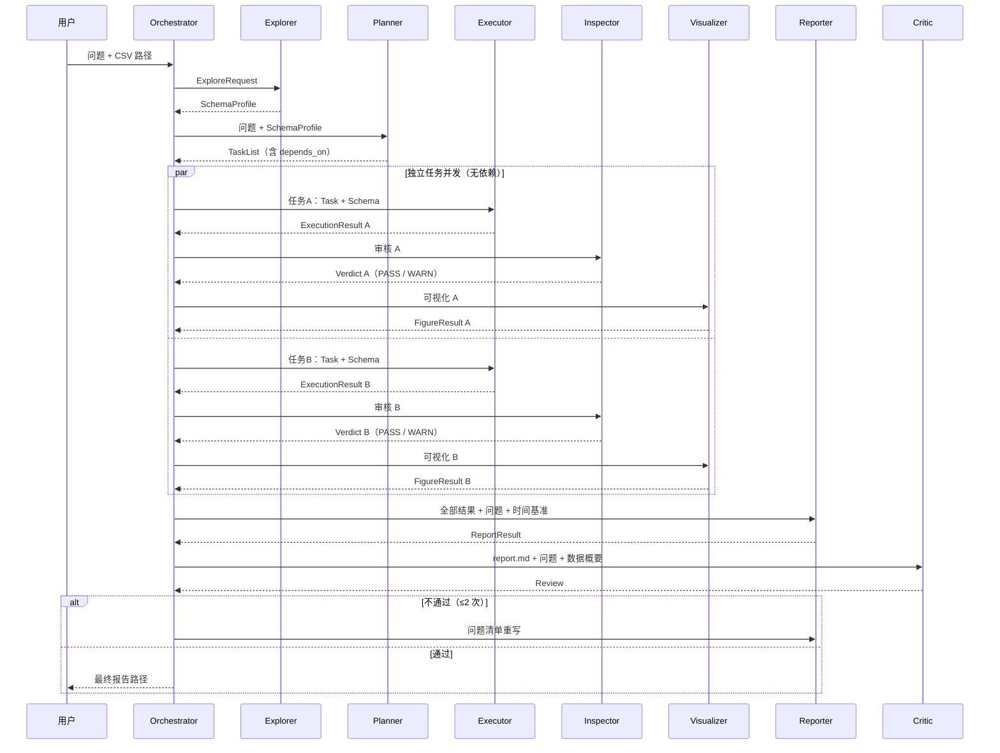

# Agent 交互设计（v1.1）

**项目**：基于多智能体协作的自动化数据分析引擎
**配套文档**：[需求分析.md](需求分析.md) / [输出格式设计.md](输出格式设计.md) / [工作规划.md](工作规划.md)

## 1. 交互模型：编排器中心化的消息路由

核心原则：**Agent 之间不直接互相调用**。所有消息都由 Orchestrator（编排器）路由，Agent 是"无状态工人"，只做三件事：读取输入消息 → 按角色处理（可能调用 LLM、执行代码）→ 返回结构化输出消息。

### 1.1 什么是 Orchestrator（编排器）

**Orchestrator 不是第 8 个角色 Agent**，而是纯代码实现的"调度中枢"，相当于导演 / 项目经理：它自己不分析数据、不写报告文字，只负责：

1. 创建 RunContext（run_id、question、data_path、outputs 目录、配置）；
2. 按固定流程唤醒 7 个角色 Agent，并把它们的消息路由给对方（Agent 之间不直接通信）；
3. DAG 调度：无依赖任务并发执行、有依赖任务按序等待；
4. 维护重试闭环（Inspector ↔ Executor、Critic ↔ Reporter）与任务状态机；
5. 恢复与回滚（两阶段产物提交、--resume）、预算计数、transcript 记录、共享资源加锁。

角色 Agent 共 7 个：Explorer / Planner / Executor / Inspector / Visualizer / Reporter / Critic。它们只处理自己环节的数据；编排器负责把它们串成一条可靠的生产线。

这样设计的好处：

- **全程可观测**：每条消息写入 transcript.jsonl，可回放、可调试；
- **职责解耦**：增删 Agent 不影响其他 Agent；
- **便于演进**：未来可替换为 LangGraph / CrewAI 等框架，消息协议保持不变。

## 2. 共享上下文 RunContext 与数据传递

- **小数据**（schema、任务、审核结论）走消息体；
- **大数据**（结果集、图表、报告）走文件，消息中只带文件路径引用。

RunContext 关键字段：

| 字段 | 说明 |
| :--- | :--- |
| run_id | 一次运行的唯一 ID |
| question | 用户原始问题 |
| data_path | CSV 路径 |
| schema_profile | Explorer 产出 |
| task_list | Planner 产出 |
| results | {task_id: ExecutionResult} |
| figures | {task_id: FigureResult} |
| report | ReportResult |
| time_base | 时间基准（默认数据最大日期） |
| config | 模型 / 超时 / 预算配置 |
| max_concurrency | 独立任务最大并发数（默认 3） |
| task_states | {task_id: TaskState} 任务状态表（PENDING/RUNNING/SUCCEEDED/FAILED/CANCELLED/SKIPPED） |
| session | 会话上下文（session_id + 最近 N 轮摘要，见[上下文与记忆设计.md](上下文与记忆设计.md)） |
| outputs_dir | outputs/run_<id>/ |
| transcript | 全部消息记录 |

outputs/run_<id>/ 目录结构：

```text
outputs/run_20260805_123456/
├── transcript.jsonl
├── schema_profile.json
├── plan.json
├── step_1_result.json        # Executor 中间结果
├── chart_task_1.png          # 图表
├── report.md
└── run_config.json           # 配置快照
```

## 3. 全流程交互序列



说明：有依赖的任务（`depends_on` 非空）等待前置任务完成后执行；任一任务 FAIL 的重试逻辑不变（见 5.1），在任务单元内完成。

## 4. 消息种类清单

| 阶段 | 发送 → 接收 | kind | 内容 | 产物 / 副作用 |
| :--- | :--- | :--- | :--- | :--- |
| 探查 | O → Explorer | explore_request | data_path | schema_profile.json |
| | Explorer → O | schema_profile | SchemaProfile JSON | - |
| 规划 | O → Planner | plan_request | question + schema | - |
| | Planner → O | task_list | TaskList JSON | plan.json |
| 执行 | O → Executor | execute_task | task + schema + 前置文件引用 | step_*.json |
| | Executor → O | execution_result | success / failed + error_class | 中间文件 |
| 审核 | O → Inspector | inspect_result | 结果 + task + question + schema | - |
| | Inspector → O | verdict | PASS / WARN / FAIL + checks + suggestion | - |
| 可视化 | O → Visualizer | visualize | 结果 + task | chart_*.png |
| | Visualizer → O | figure_result | 图表路径 + 说明 | - |
| 报告 | O → Reporter | compose_report | 全部结果 + 图表 + question + time_base | report.md |
| | Reporter → O | report_result | 报告路径 + degraded 标记 | - |
| 评审 | O → Critic | review_report | report.md + question + 数据概要 | - |
| | Critic → O | review | PASS / FAIL + issues | - |
| 重写 | O → Reporter | rewrite_report | 报告 + issues | 覆盖 report.md |

## 5. 两个反馈闭环

### 5.1 数据审核闭环（Inspector ↔ Executor）

- **代码层**：Executor 内部，代码执行失败 → 错误信息回传 LLM 自愈，最多 3 次；
- **结果层**：Inspector 判 FAIL → 携带 suggestion 返回 Executor 重做，最多 3 次；
- 任一层耗尽 → 该任务判定 failed，进入降级路径。

### 5.2 报告评审闭环（Critic ↔ Reporter）

- Critic 不通过 → 携带 issues 返回 Reporter 重写，最多 2 次；
- 重写后再评审；仍不通过则输出当前版本并标注"未经评审通过"。

### 5.3 预算控制

- 单轮运行 LLM 调用总次数上限默认 30 次（config 可调），达到上限立即终止并走降级路径。

## 6. 失败传播与降级路径

错误分类枚举：`MISSING_COLUMN` / `EMPTY_RESULT` / `CODE_ERROR` / `TIMEOUT` / `LLM_ERROR` / `UNKNOWN`。

- 单任务失败且重试耗尽 → Orchestrator 将该任务标记 failed；若其他任务不依赖它，继续执行；
- 关键任务失败或总预算耗尽 → 本次运行标记 degraded；
- degraded 时：跳过 Visualizer（无图）、跳过 Critic，直接由 Reporter 生成降级报告（失败原因 + 建议）；
- 降级报告同样写入 outputs/run_<id>/，transcript 完整记录失败链路。

任务的停止 / 继续控制、redo / undo 与文件处理规范详见[恢复与回滚设计.md](恢复与回滚设计.md)。

## 7. 实例走查

### 7.1 TC-02 正常流程（简化消息）

用户 → O：

```json
{"question": "最近7天每日销售额的走势如何？", "data_path": "demo/data/retail_sales.csv"}
```

O → Explorer：`{"data_path": "demo/data/retail_sales.csv"}`

Explorer → O：SchemaProfile（5 列，suggested_date_column=订单日期，max=2024-07-31）

O → Planner：`{"question": "...", "schema_profile": {...}}`

Planner → O：TaskList（task1：按日聚合销售额，required_columns=[订单日期, 销售额]，chart_type=line）

O → Executor：`{"task": {...}, "schema_profile": {...}}`

Executor → O：ExecutionResult（success，7 行日销售额，intermediate_file=step_1_result.json）

O → Inspector：`{"result": {...}, "task": {...}, "question": "...", "schema_profile": {...}}`

Inspector → O：Verdict（PASS，7 行非空、日期范围合理）

O → Visualizer：`{"result": {...}, "task": {...}}`

Visualizer → O：FigureResult（chart_task_1.png，note 指出最高 / 最低点）

O → Reporter：`{"question": "...", "results": {...}, "figures": {...}, "time_base": {"date": "2024-07-31"}}`

Reporter → O：ReportResult（report.md，sections 完整）

O → Critic：`{"report_path": "...", "question": "...", "data_summary": {...}}`

Critic → O：Review（PASS）

O → 用户：`{"status": "success", "report": "outputs/run_xxx/report.md"}`

### 7.2 TC-03 降级流程（简化消息）

O → Executor：`{"task": {"required_columns": ["利润"], ...}}`

Executor 内部代码自愈 3 次 → 均报 KeyError: '利润'

Executor → O：ExecutionResult（failed，error_class=MISSING_COLUMN，error="列 '利润' 不存在，可用列：[...]"）

O → Reporter：`{"degraded": true, "failure_info": {"error_class": "MISSING_COLUMN", "suggestion": "请检查列名或数据源"}}`

Reporter → O：ReportResult（degraded=true，报告含"未找到利润字段，请检查列名或数据源"）

O → 用户：`{"status": "degraded", "report": "outputs/run_xxx/report.md"}`

## 8. 实现要点

- `BaseAgent.run(context, message) -> AgentMessage`：内部 = LLM 调用 + pydantic 输出校验 + 失败重试；
- Orchestrator 按依赖图（DAG）调度：无依赖任务并发（线程池，max_concurrency 可配），有依赖任务按拓扑顺序执行；状态机 EXPLORE → PLAN → EXECUTE → VERIFY → VISUALIZE → REPORT → REVIEW → DONE / FAILED；
- 每条消息经 transcript 记录（含耗时、调用次数）；
- 消息协议以[输出格式设计.md](输出格式设计.md)为准，实现时落地为 pydantic 模型。

## 9. 执行模型：同步编排 + 任务级并行

### 9.1 v1.1 执行模型

Orchestrator 按阶段同步推进（EXPLORE → PLAN → REPORT → REVIEW 等），但**执行阶段按依赖图（DAG）调度**：

- `depends_on` 为空的任务**并发执行**（线程池，默认 max_concurrency=3）；
- `depends_on` 非空的任务等待前置任务完成后执行。

每个任务的执行单元 = 生成代码 → 子进程执行 → Inspector 审核 → Visualizer 可视化，在各自线程内完成；FAIL 重试（≤ 3 次）也在该单元内处理。

选择原因：独立任务并行收益明显（多子任务问题可缩短数倍耗时）；同步编排 + 线程池实现简单，无需把 LLM 客户端与执行器改成异步。

transcript 每条消息记录序号与时间戳，保证并发下仍可有序回放。

### 9.2 运行级并行（可选）

不同 run_id 的多次运行互不干扰（独立 outputs/run_<id>/ 目录与配置），可多进程 / 多线程同时跑，支持多用户 / 批量并发；资源隔离规则见[恢复与回滚设计.md](恢复与回滚设计.md)第 6 节。

### 9.3 预算与并发控制

- 总 LLM 调用上限（默认 30 次）不变，Orchestrator 层加锁统计；
- max_concurrency 可配置（默认 3）；单任务超时 30s、整轮总执行预算 120s 仍生效，并发任务共享预算；
- 达到上限立即终止并走降级路径；
- 共享资源统一加锁：task_states、transcript 写入、预算计数、manifest 提交均有同步保护（见 9.4）。

### 9.4 并发安全规范

共享资源与同步机制：

| 共享资源 | 风险 | 同步机制 |
| :--- | :--- | :--- |
| RunContext（只读） | Agent 误写 | 创建后只读，变更仅由 Orchestrator 持锁进行 |
| task_states | 多线程同时更新 | Orchestrator 持有 Lock，或由 futures 结果统一汇总 |
| transcript.jsonl | 并发追加交错 | TranscriptWriter 内部 Lock + 单行追加 |
| LLM 预算计数 | 并发累加丢失 | 线程安全计数器（Lock / 原子计数） |
| manifest.json | 并发提交互相覆盖 | 提交持 Lock + 临时文件 rename 原子写 |
| summary.json | 同会话并发更新 | 会话级 Lock（v1.1 会话内串行，锁为兜底） |
| execute_python 子进程 | CPU / 内存挤爆 | max_concurrency + 可选子进程信号量 |

通用规则：

1. 工具必须**无共享可变状态**：只写自己的命名空间（work/<task_id>、artifacts/step_<task_id>、本 run 目录），禁止写全局 / 静态变量；
2. 数据计算代码（pandas / matplotlib）一律在**子进程**执行 → 天然内存隔离，杜绝全局状态覆盖（如 matplotlib rcParams 冲突）；这是选择子进程而非进程内 exec 的核心理由之一；
3. 文件写入一律"临时文件 + 原子 rename"，读取方不会看到半截文件；
4. 持锁期间不做慢操作（LLM 调用 / 子进程执行不得持锁），避免长锁阻塞与死锁；
5. 锁顺序固定，避免循环等待。

### 9.5 后续可选：全异步

未来可替换为 asyncio + 异步子进程；Agent 消息协议、文件传递、transcript 格式不变，不需要重写 Agent。
