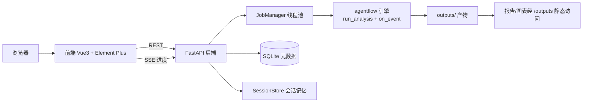

# 前后端设计方案（v1.2）

**项目**：基于多智能体协作的自动化数据分析引擎
**日期**：2026-08-16（v1.2 修订：2026-09-04）
**状态**：已定稿，进入实现

## 1. 目标与范围

把已有的 agent 引擎（agentflow，Phase 1~6）服务化：提供 Web 前后端，让用户上传 CSV、用自然语言提问、实时查看 Agent 执行进度、查看并管理报告与多轮会话。**分析逻辑全部复用引擎，不改核心算法**。

本阶段不含：双 CSV 对比（已决定暂缓）、完整多用户认证体系（预留 user_id 隔离，先单用户）。

## 2. 总体架构



## 3. 技术选型

| 层 | 选型 | 说明 |
| :--- | :--- | :--- |
| 后端 | FastAPI + uvicorn | 异步原生、自动 OpenAPI 文档 |
| 任务执行 | ThreadPoolExecutor（JobManager） | 引擎为同步代码，线程池改动最小 |
| 元数据 | SQLite（stdlib sqlite3） | 文件系统仍是产物事实来源 |
| 实时进度 | SSE（Server-Sent Events） | 单向推送，适合进度流 |
| 前端 | Vue3 + TypeScript + Vite + Element Plus + Pinia + vue-router | 中后台组件全、国内生态 |
| 图表/报告 | ECharts + markdown-it | 报告与图表渲染 |
| HTTP 客户端 | axios | Token 注入 |
| 部署 | 本地 uvicorn :8000 + Vite dev proxy | 单机优先，后续 Docker |

## 4. 后端设计

### 4.1 目录结构

```text
app/
├── main.py            # FastAPI 实例、路由挂载、静态、CORS、启动初始化
├── config.py          # 路径与配置（outputs_root、db 路径、auth 开关）
├── db.py              # SQLite 初始化与查询助手
├── jobs.py            # JobManager：提交/状态/事件缓冲（SSE 数据源）
├── security.py        # Token 生成与校验（本地单用户，预留多用户）
├── schemas.py         # 请求/响应 pydantic 模型
└── routers/
    ├── auth.py        # 登录
    ├── datasets.py    # CSV 上传/列表/删除
    ├── jobs.py        # 提交分析、查询状态、SSE 事件流
    ├── sessions.py    # 会话列表/消息/删除
    ├── reports.py     # run 列表、报告文本、评估摘要
    └── evaluations.py # 评估聚合看板数据
```

### 4.2 API 一览

| 方法 | 路径 | 说明 |
| :--- | :--- | :--- |
| POST | /api/auth/login | 登录拿 Token |
| POST | /api/datasets | 上传 CSV（校验编码，返回 schema 画像） |
| GET | /api/datasets | 数据集列表 |
| POST | /api/analyze | 提交分析 {question, dataset_id, mode, session_id?} → job_id |
| GET | /api/jobs/{job_id} | 查询 job 状态与结果 |
| GET | /api/jobs/{job_id}/events | SSE 进度事件流 |
| GET | /api/sessions | 会话列表 |
| POST | /api/sessions | 新建会话 |
| GET | /api/sessions/{id}/messages | 会话全部轮次（历史） |
| POST | /api/sessions/{id}/messages | 在会话中发起新一轮 |
| DELETE | /api/sessions/{id} | 删除会话 |
| GET | /api/runs | 运行历史（读 evaluation.json） |
| GET | /api/reports/{run_id} | 报告 Markdown 文本 |
| GET | /api/evaluations/summary | 评估聚合（success/partial/degraded、图表/评审通过率） |
| GET | /outputs/... | 产物静态访问（报告引用图表） |

### 4.3 Job 任务模型与 SSE

- 提交分析 → 生成 job_id，插入 jobs 表（status=pending）→ 线程池执行；
- 执行中通过 `on_event` 回调推送事件：`phase`（explore/plan/execute/report/review）、`message`（Agent 消息）、`task`（任务状态）、**`clarify_request`（v1.2：非阻塞澄清，前端渲染提示卡片，含 question/options/suggestion）**、**`error_routed`（v1.2：错误路由决策，进度流标注"已转交重规划"）**、`done`（最终状态 + run_id）；
- JobManager 为每个 job 维护事件缓冲（线程安全），SSE 端点按索引增量发送，job 结束发送 done 后关闭；
- job 状态与引擎四态对齐：pending/running/success/partial/degraded/failed。

### 4.4 数据模型（SQLite）

```text
users    (id, username, password_hash, created_at)
datasets (id, user_id, filename, path, size, row_count, columns_json, created_at)
jobs     (id, job_id, user_id, question, mode, session_id, run_id, status, progress, error, created_at, finished_at)
sessions (id, session_id, user_id, title, dataset_path, created_at, updated_at)
```

产物（report.md / charts / evaluation.json / conversation.jsonl）仍存文件系统，DB 只存索引与状态。

### 4.5 引擎对接（on_event 钩子）

`pipeline.run_analysis(..., on_event=None)` → Orchestrator 在阶段切换、每条 Agent 消息、任务完成时调用 `on_event(dict)`；JobManager 将事件写入缓冲并更新 DB 进度。引擎其余逻辑零改动。

### 4.6 会话与轮次管理

- 一次对话 = 一个 session_id（`outputs/sessions/<session_id>/`）；一次提问 = 一个 turn；
- 历史全量保留（conversation.jsonl 清洗条目）+ 滚动摘要（summary.json）；
- 前端会话页可新建/切换/继续/删除；聊天页按轮次渲染"提问 → 进度 → 报告"卡片流，每轮带 run_id 溯源。

### 4.7 安全

- 登录发 Token（Bearer）；本地默认内置用户 admin；
- 上传校验：扩展名、大小上限（默认 50MB）、编码检测复用 Explorer；
- 路径守卫复用引擎 `ensure_allowed`，产物静态访问限定在 outputs 内；
- 多用户预留：表带 user_id，目录规划 user_id 根层（见安全与隔离设计）。

## 5. 前端设计

### 5.1 目录结构

```text
frontend/
├── package.json / vite.config.ts / tsconfig.json / index.html
└── src/
    ├── main.ts / App.vue
    ├── api/           # axios 客户端 + 接口封装
    ├── stores/        # Pinia：auth、session
    ├── router/        # 路由
    ├── views/         # Login / Workbench / Datasets / Sessions / Reports
    └── components/    # AgentProgress、ReportViewer、DatasetSelect、ChatPanel
```

### 5.2 页面与路由

| 路由 | 页面 | 核心功能 |
| :--- | :--- | :--- |
| /login | 登录 | Token 获取与存储 |
| / | 分析工作台 | 聊天式提问：选数据集 → 输入问题 → SSE 实时 Agent 进度 → 完成跳报告 |
| /datasets | 数据管理 | 上传/删除/预览 CSV（画像） |
| /sessions | 会话管理 | 会话列表、新建/继续/删除、查看摘要与冲突提醒 |
| /reports | 历史与报告 | run 列表（状态/耗时/LLM 调用）、报告 Markdown 渲染 + 图表 |

### 5.3 关键组件

- **ChatPanel**：多轮消息流（问题 → 进度卡片 → 报告摘要），支持会话续聊；
- **AgentProgress**：按 SSE 事件渲染时间线（探查→规划→执行→审核→报告→评审）与任务状态；
- **ReportViewer**：markdown-it 渲染报告，图片走 /outputs 静态路径，支持下载；
- **DatasetSelect**：数据集下拉 + 画像信息展示。

### 5.4 状态管理

- auth store：token 持久化（localStorage）与 axios 拦截器注入；
- session store：当前会话、轮次列表、SSE 连接管理。

## 6. 部署

```powershell
# 后端
.\.venv\Scripts\python.exe -m uvicorn app.main:app --port 8000
# 前端（开发）
cd frontend
npm install
npm run dev          # Vite 代理 /api 与 /outputs 到 :8000
```

生产：`npm run build` 产物由 FastAPI 静态托管。

## 7. 实现阶段

1. **后端骨架**：on_event 钩子 + FastAPI + SQLite + JobManager + SSE + 数据/会话/报告/评估接口；
2. **前端骨架**：登录 + 数据管理 + 工作台（聊天 + 进度流）+ 报告/会话页；
3. **联调**：SSE 进度、报告渲染、会话续聊打通；
4. **打磨**：评估看板、错误处理、Docker 化。
