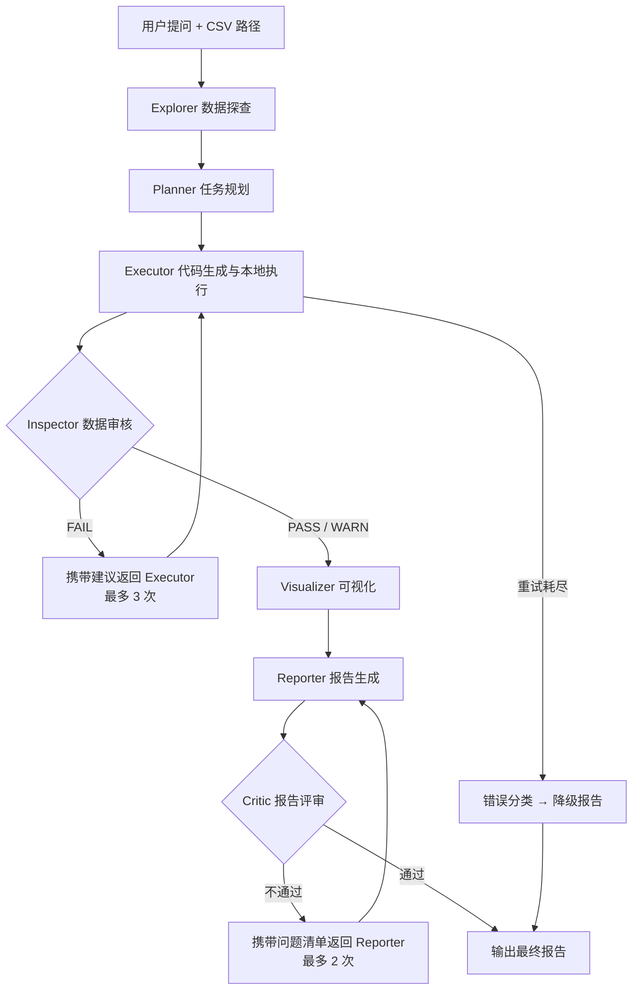

# 多智能体数据分析系统 – 需求规格说明书

**项目名称**：基于多智能体协作的自动化数据分析引擎
**版本**：v1.1（评审修订版）
**文档类型**：需求规格说明书
**目标用户**：业务分析师 / 产品经理 / 数据爱好者

## 0. v1.0 → v1.1 变更摘要

- 新增**数据探查（Explorer）**、**可视化（Visualizer）**、**报告评审（Critic）** 三个智能体，工作流由单闭环升级为"数据审核 + 报告评审"双闭环。
- 代码执行方案由 `exec()` 进程内执行改为**本地子进程执行**，不依赖沙箱，并明确安全边界。
- `required_columns` 不再由 Planner 猜测，改为以 Explorer 探查到的**真实表结构**为准，并做列名校验。
- 补充失败终态路径：重试耗尽后输出结构化错误，并生成降级报告，系统不崩溃。
- 明确"最近 7 天 / 上周"等相对时间的基准约定。
- Inspector 审核规则改为 PASS / WARN / FAIL 分级，避免对合法业务数据（如退款）误报。
- 新增非功能性需求（成本预算、可观测性、配置化、编码兼容、隐私）。
- 验收标准配套自动化测试（固定 demo 数据 + mock LLM）。

## 1. 项目概述

### 1.1 产品定位

一个命令行交互式的数据分析工具。用户输入中文业务问题并指定本地 CSV 文件，系统自动调度多个 AI 智能体协作完成数据探查、任务规划、代码执行、数据校验、可视化与报告生成，最终输出一份图文并茂的 Markdown 分析报告。

### 1.2 核心价值

- **零代码分析**：非技术人员通过自然语言即可获得数据洞察。
- **高可靠性**：通过"数据审核 + 报告评审"双闭环机制，显著降低大模型生成代码的幻觉和错误率。
- **过程透明**：完整记录每个智能体的输入、输出与执行日志，结果可追溯。
- **本地执行**：分析代码在本机运行，不依赖远程沙箱；数据不出本机（仅 schema 摘要与代码摘要发送给 LLM）。

### 1.3 目标用户

- 业务分析师
- 产品经理
- 数据爱好者 / 运营人员

### 1.4 典型业务场景与示例问题

示例数据假设为**电商零售销售数据**；注意：以下字段仅为示例，**实际运行时的字段以 Explorer 探查到的真实表结构为准**，Planner 不得臆造列名。

| 类型 | 示例问题 |
| :--- | :-------------------------------------------------------------------- |
| 汇总统计 | "总销售额是多少？" / "一共有多少笔订单？" |
| 趋势分析 | "最近7天的每日销售额变化趋势如何？" |
| 对比筛选 | "哪个产品类别上个月卖得最好？" / "华东地区销量最高的产品是什么？" |

### 1.5 相对时间基准约定

- 用户问题中的"最近 7 天""上周""上个月"等相对时间，默认以**数据集内最大日期**为基准计算。
- 用户可通过命令行参数显式指定截止日期。
- 报告中必须写明所采用的时间基准与数据范围，保证结论可复现。

## 2. 系统架构设计

### 2.1 智能体（Agent）角色定义

| 智能体 | 角色定位 | 核心职责 | 主要输入 | 输出格式 | 依赖 |
| :--- | :--- | :--- | :--- | :--- | :--- |
| **Explorer** | 数据探查员 | 读取并探查 CSV，输出真实 schema 摘要 | CSV 路径 | SchemaProfile（JSON） | 无 |
| **Planner** | 数据分析规划师 | 结合 schema 将模糊问题拆解为 1~5 个结构化子任务 | 用户问题 + SchemaProfile | List[Task]（JSON） | Explorer |
| **Executor** | 高级数据工程师（Code Agent） | 按任务生成 Python 代码并在本地子进程执行 | Task 列表 + SchemaProfile | 结果摘要 JSON + 中间文件 | Planner |
| **Inspector** | 数据质量审核员 | 校验执行结果的数据质量 | 执行结果 + 原始任务 + 原始问题 + SchemaProfile | Verdict（PASS/WARN/FAIL + 建议） | Executor |
| **Visualizer** | 数据可视化师 | 按数据特征选择合适的图表并生成图片 | 审核通过的结果 + Task | .png 图表文件 + 说明 | Inspector |
| **Reporter** | 商业智能汇报专家 | 将数据、图表与洞察整合为 Markdown 报告 | 全部结果 + 原始问题 + 时间基准 | report.md | Visualizer |
| **Critic** | 报告评审员 | 评审报告完整性、准确性与洞察力 | report.md + 原始问题 + 数据概要 | Review（通过/问题清单） | Reporter |

### 2.2 核心工作流（双闭环）



**失败终态**：Executor 重试 3 次仍失败时，将错误分类为「字段缺失 / 数据为空 / 代码错误 / 超时」，输出结构化错误并转交 Reporter 生成**降级报告**（说明失败原因与建议），系统不崩溃、不输出空报告。

**任务级并行**：Planner 拆解出的任务若相互独立（`depends_on` 为空），由 Orchestrator **并发调度执行**，缩短总耗时；有依赖关系的任务按拓扑顺序等待前置任务完成。并发上限通过配置控制（默认 3）。

### 2.3 数据流向说明

1. 用户输入自然语言问题与 CSV 路径 → Explorer 探查数据，生成 SchemaProfile（列名、类型、样例、缺失率、行数、编码、日期格式建议）。
2. Planner 基于 SchemaProfile 输出结构化任务清单（`required_columns` 必须真实存在于 schema）。
3. Executor 逐任务生成 Python 代码，在本地子进程执行（独立任务并发），结果写入中间文件并生成结果摘要。
4. Inspector 审核结果 → PASS / WARN / FAIL，FAIL 时携带建议返回 Executor。
5. 审核通过后 → Visualizer 生成图表。
6. Reporter 整合数据、图表与文字 → `outputs/run_<id>/report.md`。
7. Critic 评审 → 通过则输出最终报告，否则携带问题清单返回 Reporter。

### 2.4 代码执行设计（本地执行，不依赖沙箱）

- Executor 将每个任务生成独立 Python 脚本，通过**本地子进程**执行（如 `python -I 脚本路径`）。
- 执行约束：
  - 单任务超时（默认 30 秒），整轮总执行预算 120 秒；
  - 捕获 stdout / stderr 与退出码，异常回传 LLM 自愈。
- 任务间数据通过**中间文件**传递（CSV / JSON），为后续任务并行执行留好接口。
- **安全边界（必须在产品提示与文档中说明）**：
  - 生成代码以当前用户权限在本机运行，**并非沙箱**，理论上可读写本机文件；
  - 工具应提示用户：仅对可信的数据与分析任务使用；处理敏感或不可信数据时，建议后续引入容器隔离（见路线图）；
  - 默认约定不访问外部网络（生成代码不主动联网，后续可增加网络白名单配置）。

## 3. 详细功能需求

### 3.1 Explorer Agent（数据探查员）

#### 职责描述

读取本地 CSV，输出准确、真实的 schema 摘要，为后续所有智能体提供数据上下文。

#### 输入

- CSV 文件路径

#### 输出（SchemaProfile，JSON）

```json
{
  "file_path": "data/source.csv",
  "encoding": "utf-8-sig",
  "row_count": 10000,
  "column_count": 5,
  "columns": [
    {
      "name": "订单日期",
      "dtype": "datetime64",
      "missing_rate": 0.0,
      "sample": ["2024-01-01"],
      "is_date": true
    }
  ],
  "suggested_date_column": "订单日期",
  "issues": ["存在 2 个含缺失值的列"]
}
```

#### 验收标准

- 能自动识别 CSV 编码（utf-8-sig / GBK 等）并正确解析日期列。
- schema 中列名与真实数据一致，缺失率准确。

### 3.2 Planner Agent（规划者）

#### 职责描述

结合 SchemaProfile，将用户的模糊业务问题拆解为 1~5 个结构化、可执行的子任务。

#### 输入

- 用户输入的自然语言问题
- Explorer 输出的 SchemaProfile

#### 输出格式（JSON）

```json
[
  {
    "task_id": 1,
    "description": "计算总销售额",
    "required_columns": ["销售额"],
    "code_hint": "使用 sum() 函数",
    "chart_type": "none",
    "depends_on": []
  },
  {
    "task_id": 2,
    "description": "按日统计销售额趋势",
    "required_columns": ["订单日期", "销售额"],
    "code_hint": "按日期分组聚合",
    "chart_type": "line",
    "depends_on": []
  }
]
```

#### 关键规则

- `required_columns` **必须取自 SchemaProfile 中的真实列名**，不得臆造。
- 输出校验：Planner 输出经 schema 校验（列名存在性、类型合法性）；校验失败 → 携带正确 schema 重新规划（≤ 2 次）。
- `chart_type` 仅作建议值，实际图表由 Visualizer 按数据特征决定：`"none" / "line" / "bar" / "pie" / "hist"`。
- `depends_on`：任务依赖列表，空数组表示无依赖（可并行执行），非空时只能引用已存在的更小 task_id（保证拓扑顺序）。
- JSON 可靠性：不依赖 prompt 保证，使用 pydantic 等 schema 校验 + 解析失败重试（≤ 2 次）。

#### 验收标准

- 能正确拆解"汇总统计""趋势分析""对比筛选"三类典型问题。
- 输出的所有 `required_columns` 均真实存在于数据中。

### 3.3 Executor Agent（执行者）

> 这是整个系统的核心 Code Agent。

#### 职责描述

根据 Planner 输出编写并执行 Python 代码（Pandas），从 CSV 中提取、计算数据。

#### 输入

- Task 列表
- SchemaProfile
- CSV 文件路径

#### 行为逻辑

1. 针对每个子任务调用 LLM 生成 Python 代码。
2. 代码以独立脚本形式在**本地子进程**执行（见 2.4）。
3. 执行成功 → 生成结果摘要 JSON 与中间文件。
4. 执行失败 → 捕获异常信息，连同代码与错误回传 LLM 自愈，最多重试 3 次。
5. 重试耗尽 → 错误分类（字段缺失 / 数据为空 / 代码错误 / 超时）并输出结构化错误。

#### 代码生成 Prompt 要求

- 只输出纯 Python 代码，禁止 Markdown 代码块标记，以便直接写入脚本文件。
- 代码必须包含异常捕获逻辑，保证子进程能返回结构化错误。

#### 验收标准

- 能正确执行"求和""分组聚合""日期过滤"等常见 Pandas 操作。
- 字段不存在时能自动重试，并最终输出「字段缺失」分类错误。
- 单任务执行不超时。

### 3.4 Inspector Agent（审核者）

#### 职责描述

检查 Executor 输出，判断数据质量与合理性。

#### 输入

- 执行结果（DataFrame / JSON 摘要）
- 原始子任务描述 + 原始用户问题
- SchemaProfile

#### 审核规则（分级）

| 级别 | 含义 | 处理 |
| :--- | :--- | :--- |
| PASS | 数据可用 | 进入 Visualizer |
| WARN | 有疑点但可用 | 进入 Visualizer，疑点写入报告 |
| FAIL | 结果不可用 | 携带建议返回 Executor |

审核项：

1. 结果是否为空：结合任务上下文判断（宽泛统计为空 → FAIL；窄条件筛选为空 → 提示但可为 WARN）。
2. 数值异常：如销售额为负 → 先判断业务场景（退款 / 退货合法），按 WARN 标注而非一律 FAIL。
3. 日期列格式与范围是否合理。
4. 行数是否合理：对比原数据规模与筛选条件。
5. 结果是否能回答原始问题。

#### 验收标准

- 对合法退款等负值业务数据不误报 FAIL。
- 能识别「字段缺失导致的空结果」并给出正确建议。

### 3.5 Visualizer Agent（可视化师）

#### 职责描述

根据数据特征选择合适的图表类型并生成 PNG。

#### 选图规则

- 时间序列 → 折线图
- 类别 Top-N 对比 → 柱状图
- 占比分析且类别数 ≤ 8 → 饼图（类别过多时改用柱状图 Top-N）
- 数值分布 → 直方图

#### 输出

- 图表文件：`outputs/run_<id>/chart_task_{task_id}.png`
- 图表说明（标题、坐标轴含义、观察到的特征）

#### 验收标准

- 中文标签不乱码（配置微软雅黑 / SimHei 等中文字体）。
- TC-02 场景正确输出折线图。

### 3.6 Reporter Agent（汇报者）

#### 职责描述

将审核通过的数据、图表与洞察整合为图文并茂的报告。

#### 输出要求

- 文件：`outputs/run_<id>/report.md`
- 图表通过 `` 嵌入。
- 必须包含：**总体概况 / 数据详情 / 趋势分析 / 结论建议**。
- 明确标注时间基准与数据范围。
- 文字基于真实计算结果，有洞察而非简单复述。

#### 降级报告模板（失败终态时）

```markdown
# 数据分析报告（未完成）

> 生成时间：{timestamp}

- 失败原因：{错误分类 + 详细错误}
- 建议：{如：未找到"利润"字段，请检查列名或数据源}
```

#### 验收标准

- 输出 `outputs/run_<id>/report.md`。
- 任务需要时报告至少含 1 张图表。
- TC-03 场景输出降级报告且提示"未找到利润字段"。

### 3.7 Critic Agent（评审者）

#### 职责描述

在报告交付前做最后一道质量关，检查报告是否完整、准确、有洞察。

#### 评审项

1. 目录结构完整（总体概况 / 数据详情 / 趋势分析 / 结论建议）。
2. 图表嵌入正确、引用路径有效。
3. 文字结论与数据结果一致（无幻觉数字）。
4. 原始问题是否被回答。
5. 洞察质量：是否指出亮点 / 异常 / 建议。

#### 处理

- 通过 → 输出最终报告。
- 不通过 → 携带问题清单返回 Reporter 重写，最多 2 次。

#### 验收标准

- TC-02 报告中能指出最高点与最低点（自动化断言数值与真实计算结果一致）。

### 3.8 任务恢复与回滚（需求要点）

- **任务状态机**：PENDING / RUNNING / SUCCEEDED / FAILED / CANCELLED / SKIPPED 六态，运行级另有 SUCCEEDED / DEGRADED / CANCELLED。
- **失败重试矩阵**：LLM 输出校验失败重试 ≤ 2 次；代码执行异常与超时自愈 ≤ 3 次；Inspector FAIL 重做 ≤ 3 次；均采用指数退避。
- **停止与继续**：任务失败只停止该任务及其下游（下游 SKIPPED），无关独立任务继续执行；预算耗尽或用户中断时停止整个 run；支持 `--resume` 断点续跑。
- **文件处理**：产物采用"私有工作区 → 审核通过后原子提交"的两阶段机制；redo 重置任务及其下游并重建产物；undo 回滚到 PENDING；transcript 只追加不回滚；报告只引用已提交且有效的产物。
- 详细规范见[恢复与回滚设计.md](恢复与回滚设计.md)。

### 3.9 上下文与记忆（需求要点）

- **任务内多轮**：自愈 / 重试 / 重做均以"结构化增量"回传最新失败信息，历史按预算上限截断，不回传全量历史。
- **运行内共享**：RunContext 为唯一共享上下文（schema / 任务 / 结果），Agent 只读授权字段；transcript 全量记录但不直接作为 LLM 上下文。
- **会话记忆**：CLI 支持多轮连续提问；会话记录存 `outputs/sessions/<session_id>/conversation.jsonl`；早期历史滚动摘要（结构化保留目标 / 结论 / 约束）+ 最近 N 轮清洗后原文注入 Planner；原始意图固定锚定防注意力稀释；摘要仅作上下文提示，结论以真实计算结果为准。
- **隔离与恢复**：会话目录与运行目录分离；`--resume` 恢复运行、`--session` 恢复对话记忆。
- 详细设计见[上下文与记忆设计.md](上下文与记忆设计.md)。

### 3.10 评估机制（需求要点）

- **单轮自动评估**：每个 run 产出 `outputs/run_<id>/evaluation.json`（数值一致性、任务状态、成本、边界拦截）。
- **LLM 辅助评审**：洞察质量、因果表述、摘要保留率等按固定评分标准打分，且必须锚定 artifacts 中的真实数据。
- **人工抽样**：定期抽样报告质量，收集误报 / 漏报案例。
- **因果规则**：禁止无依据因果表述（相关 ≠ 因果）；描述性分析只能给相关性。
- **评估-优化闭环**：测试集（TC-01~03 + 扩展）回归验证，结果聚合到[评估记录.md](评估记录.md)。
- 详细设计见[评估方案.md](评估方案.md)。

## 4. 非功能性需求

- **本地运行**：除 LLM API 调用外全部在本机完成；代码执行不依赖外部沙箱。
- **LLM 可插拔**：兼容 OpenAI 接口（OpenAI / DeepSeek / 通义等），模型名、温度、超时、重试次数通过 YAML 配置；API Key 通过 `.env` 管理。
- **成本预算**：单轮运行 LLM 调用总次数上限（默认 30 次），防止多层重试放大成本；重试采用指数退避。
- **可观测性**：`outputs/run_<id>/` 下保存 `transcript.jsonl`（全部 Agent 消息）、执行日志、产物与配置快照。
- **并发执行**：独立任务并行处理；最大并发数通过配置（max_concurrency）控制，任务依赖通过 `depends_on` 表达。
- **资源隔离**：任务与运行产物按命名空间隔离（run_id / task_id），先后或并发运行互不干扰；规范见[恢复与回滚设计.md](恢复与回滚设计.md)。
- **安全与反注入**：威胁模型覆盖跨任务 / 跨运行 / 跨用户泄露与提示词注入；采用能力授权（grants）+ 权限根 + 执行后端抽象（本地加固 / 可选容器化），详见[安全与隔离设计.md](安全与隔离设计.md)。
- **编码与兼容**：CSV 编码自动检测；日期解析容错；依赖版本固定于 requirements。
- **隐私**：不向 LLM 发送原始数据全量，仅发送 schema 摘要、计算结果摘要与代码。

## 5. 验收标准

| 测试 ID | 输入问题 | 预期结果 |
| :--- | :--- | :--- |
| TC-01 | "总销售额是多少？" | report.md 包含总销售额数字结论，无需图表 |
| TC-02 | "最近7天每日销售额的走势如何？" | 报告含折线图，文字指出最高点与最低点，并写明时间基准 |
| TC-03 | "分析一下上周的利润情况"（CSV 无利润列） | 系统不崩溃；Executor 重试后失败，输出降级报告提示"未找到利润字段" |

**自动化验收**：以上用例配套固定 demo 数据集与 mock LLM，通过 pytest 一键运行，报告中的断言与真实计算结果一致。

## 6. 后续路线图（v1.1 之后）

- 人在环：执行前让用户确认规划结果。
- 多数据源 / 多表 / SQL 查询支持。
- 容器化隔离执行（Docker），提升不可信数据场景的安全性。
